# Welcome to Ecosystem Collaboration

This project uses IBM Watson Discovery to build a platform for promoting collaboration. It allows companies to sign up to the platform and project managers to search for companies to collaborate with. This is proof of concept project that runs locally using [Docker](https://www.docker.com) which eliminates the need to install dependencies onto your machine. Dummy data is uploaded to the Discovery Collection when the project is first run.

## Prerequisites for running the project

- Create an IBM Cloud account. Accounts can be created for free [here](https://cloud.ibm.com/registration).
- Download and install [Docker](https://www.docker.com/get-started).

## Preparing and running the project

Once all the prerequisites have been met, you will need to clone this repository and then create a Discovery Collection.

### Cloning this repository

1. Open Terminal
2. Clone the Repository  
   `> git clone https://github.com/03Farhan/ecosystem-collaboration-tool.git`

### Creating a Discovery Collection

After creating an IBM Cloud account, follow these instructions in order to create a Watson Collection. Information about the collection needs to be entered in the `template.env` file located in `./backend` so that the webapp can access the Collection. The following instructions describe how to do this:

1. Login to your account and click on "Create resource".

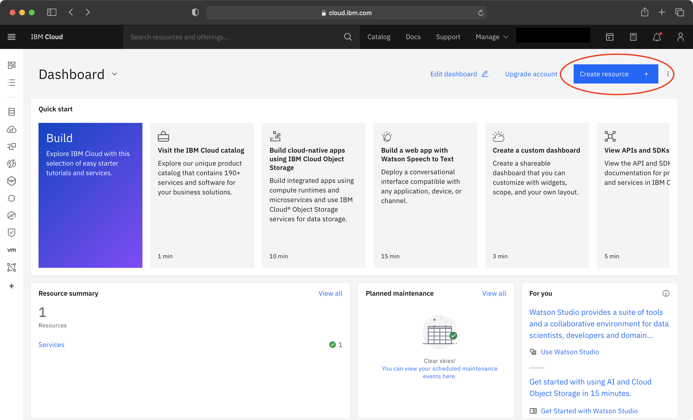

2. Type "Watson Discovery" into the search field and click on Watson Discovery. This will redirect you to a page where you can create a new free "lite" Watson Discovery Instance.

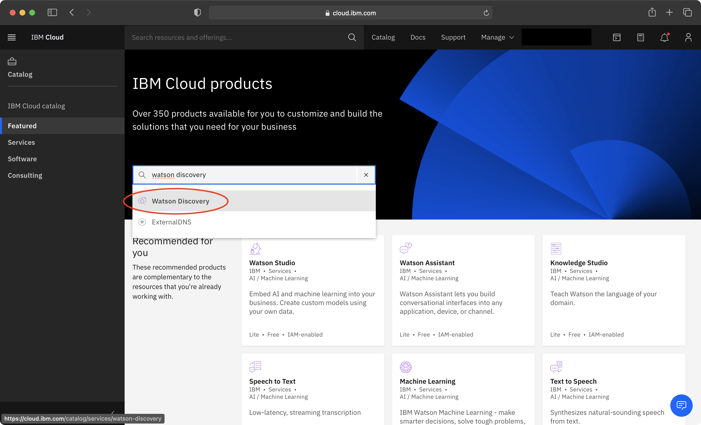

3. Fill out the fields to create the Watson Discovery Instance and then open the sidebar and click on "Resource List".

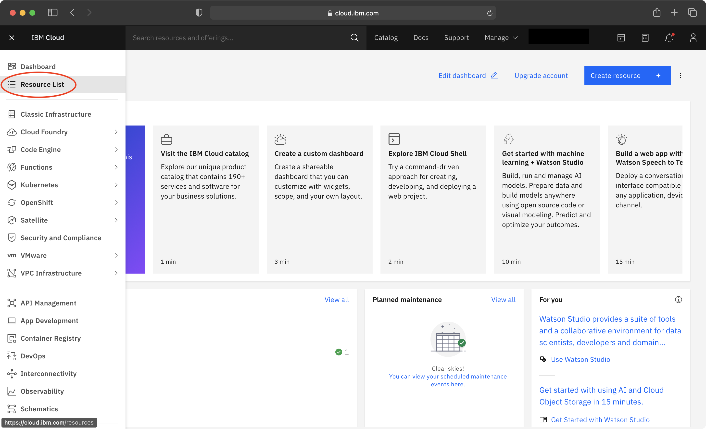

4. Click on the new the new instance that you have created under the "Services" tab. It may take a few minutes for the new instance to be deployed fully.

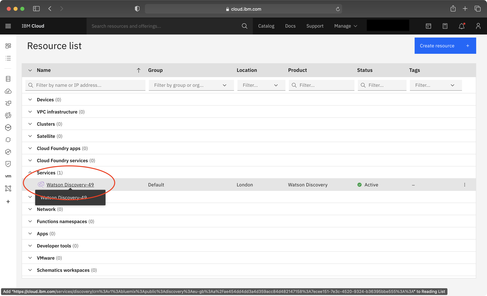

5. Copy the API Key and paste it to replace "<api_key>" in the template.env file and then copy the URL and paste it to replace "<service_url>" in the template.env file. Click "Launch Discovery".

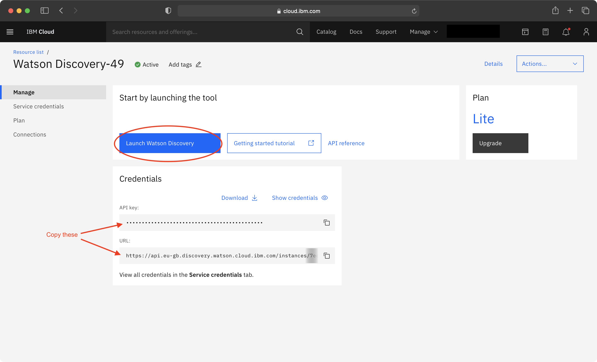

6. Click on "Upload your own data" and enter a collection name (e.g. "Ecosystem Collaboration Tool") and then click "Create". (When you click on "Upload you own data", you may see a prompt regarding setting up Discovery for your own private data. Just click on "Set up with current plan" to continue).

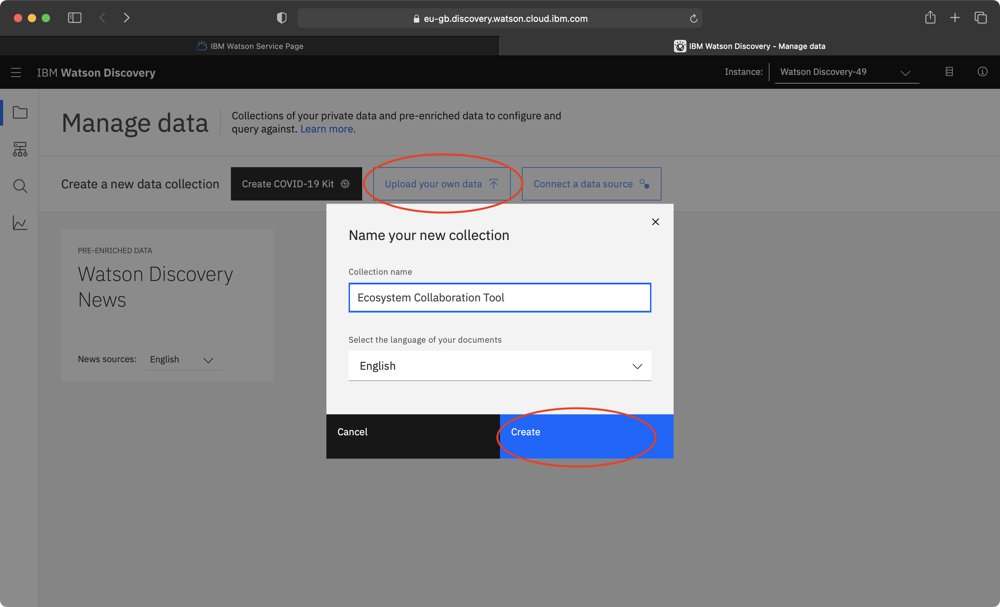

7. Once the collection has been made, click the API button near the top right and copy the "Collection ID" and "Environment ID" and paste it to replace the "<collection_id>" and "<environment_id>" respectively.

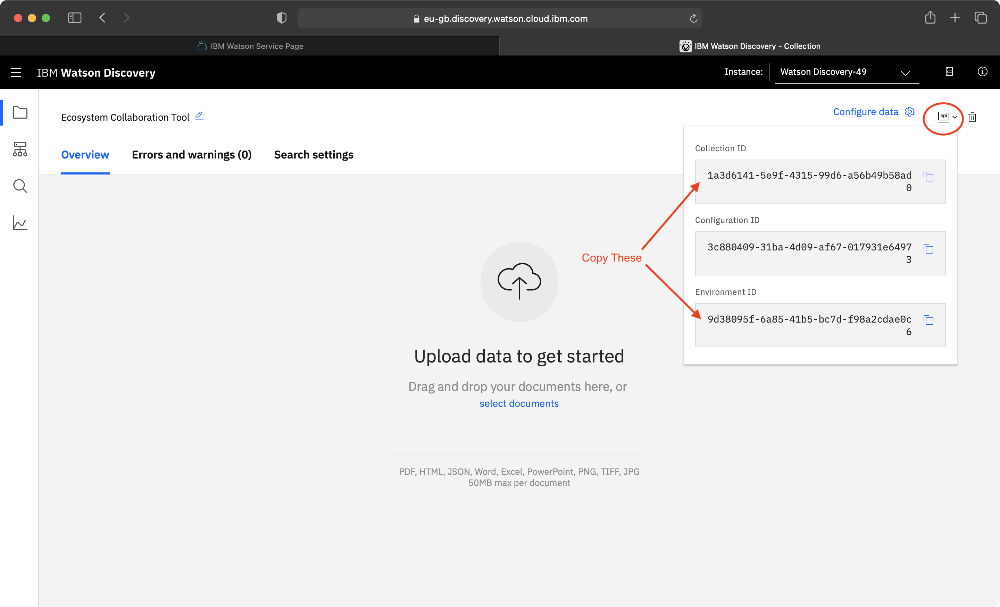

### Running the project

1. Open Terminal again and enter the repository folder.  
   `> cd ecosystem-collaboration-tool`
2. Rename the 'template.env' file to '.env'.  
   `> mv backend/template.env backend/.env`
3. Start Docker and wait until it is running. Ensure that ports 3000 and 9000 are not being used by any other programs.
4. Start the web application  
   `docker-compose up`
5. Navigate to `http://localhost:3000` on a browser and enjoy!

### Terminating the webapp

The webapp will still be running if it has not been manually closed even if the Terminal app has been closed. To check if the webapp is still running, either navigate to `http://localhost:3000` on a new window or run `docker ps` in Terminal. If the two containers for this webapp are shown, the project is still running. Even if the webapp is not running, follow step 2 to remove containers, networks, volumes, and images created by `docker-compose up`.

1. Open Terminal again and enter the repository folder.  
   `> cd ecosystem-collaboration-tool`
2. Run the following command.  
   `> docker-compose down`

## Using the project

There are three use cases for this project which are outlined in the use case diagram below.

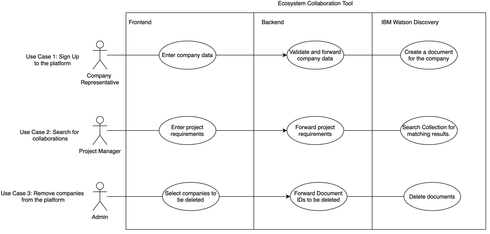

### Sign Up

For a user to sign up, they need to navigate to the sign up page by either clicking on the sign up button on the homepage or by navigating to `http://localhost:3000/signup`.

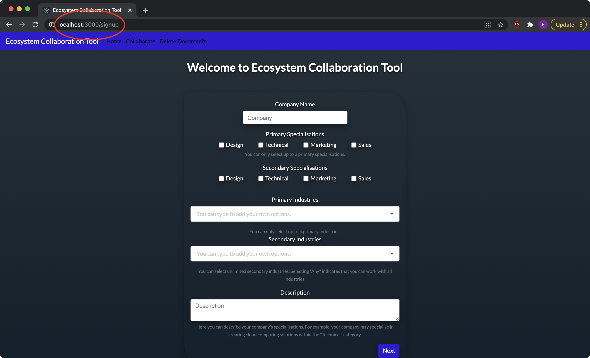

After filling out the required information in the sign-up form, the user can submit the form by clicking the 'Submit' button on the final page of the form.

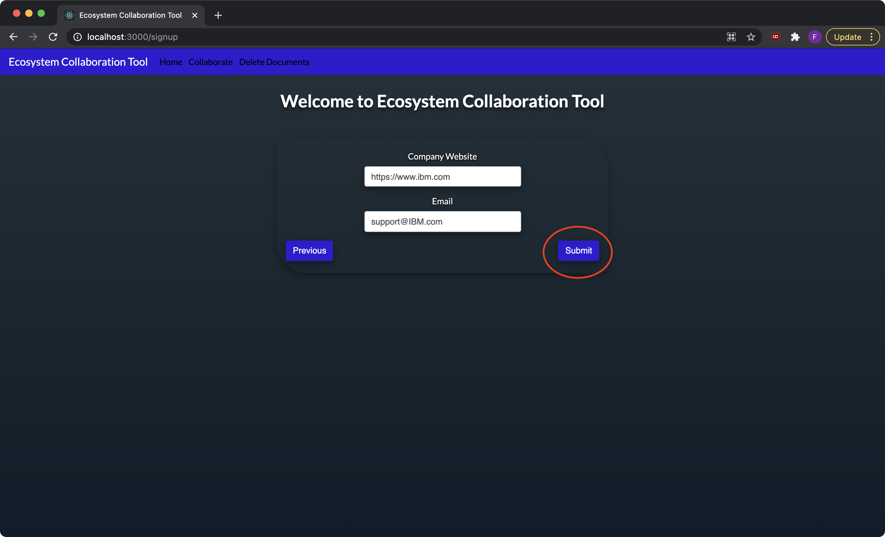

A success message will be displayed that indicates that the sign up has been successful.

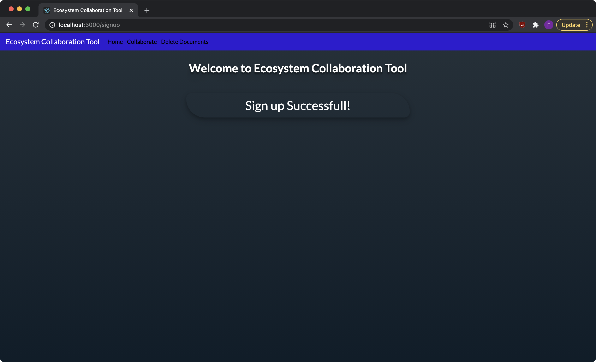

### Collaboration Search

In order for a user to search the platform, they need to navigate to the collaboration page by either clicking on the collaborate button on the homepage or navbar, or by navigating to `http://localhost:3000/collab`. This page allows users to enter their project requirements and submit the form to see the results.

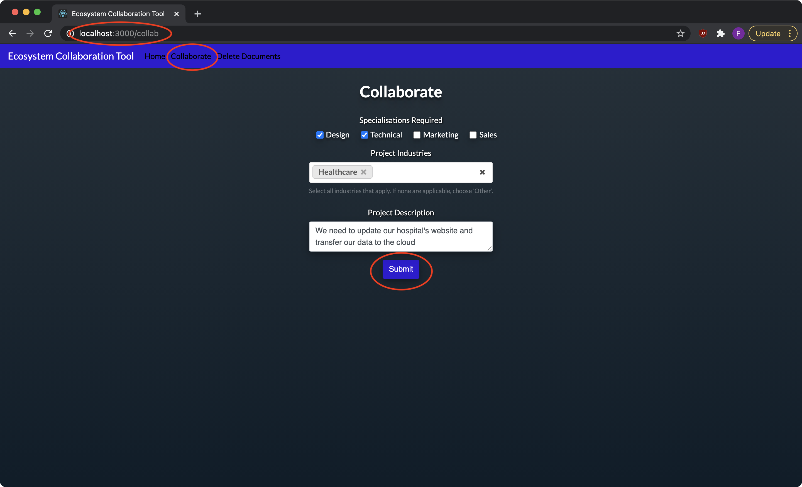

After the search has been executed, the results will be displayed on a graph as shown below.

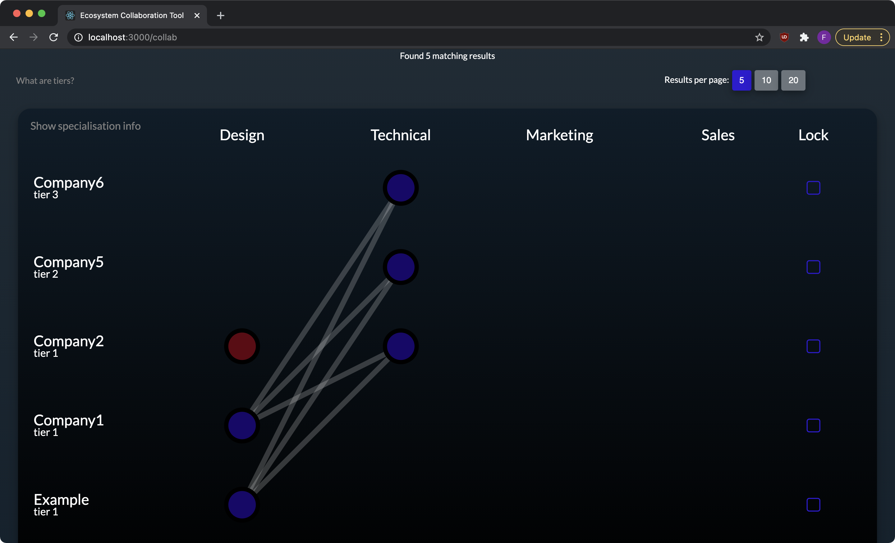

Here the user is able to change the number of results per page, lock results and view more information about companies by clicking on a company's name. Clicking on a company's name will add a tab at the bottom which allows the user to view the information about that company.

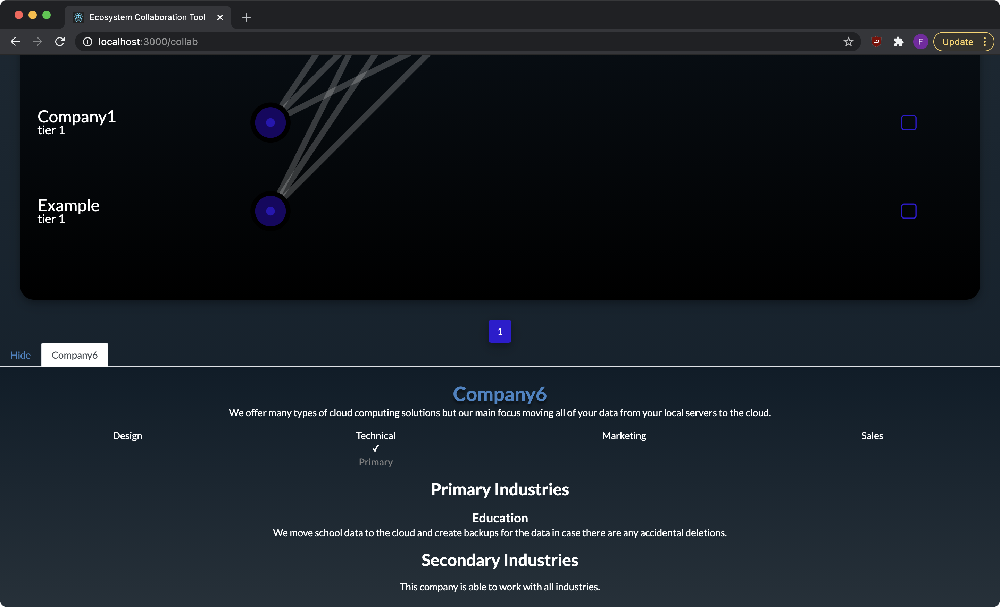

Locking a company ensures that a particular result stays on the graph even when the page is changed. It also adds a tab at the bottom which shows that company's information.

### Removing Companies

A company is removed from the platform by deleting that company's document from the Discovery Collection. This can be done from the Delete Documents page that can be navigated to from the navbar or by entering the URL `http://localhost:3000/withdraw`.

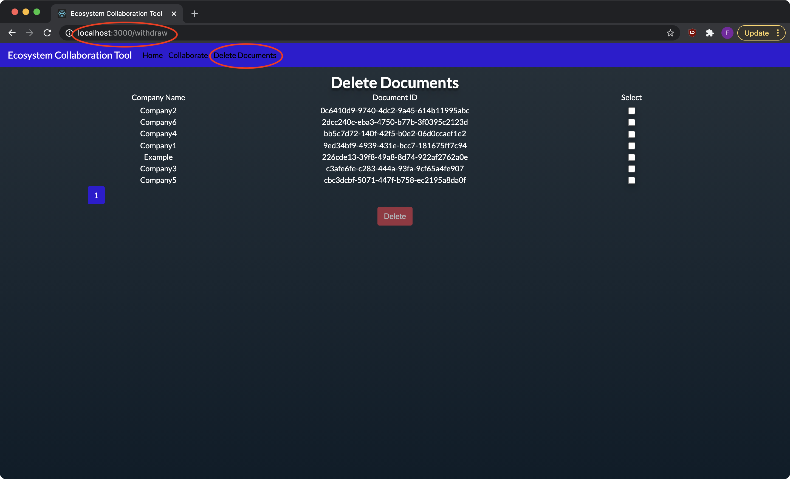

To delete companies, select the checkboxes associated to the companies that need to be deleted. Then click the Delete button.

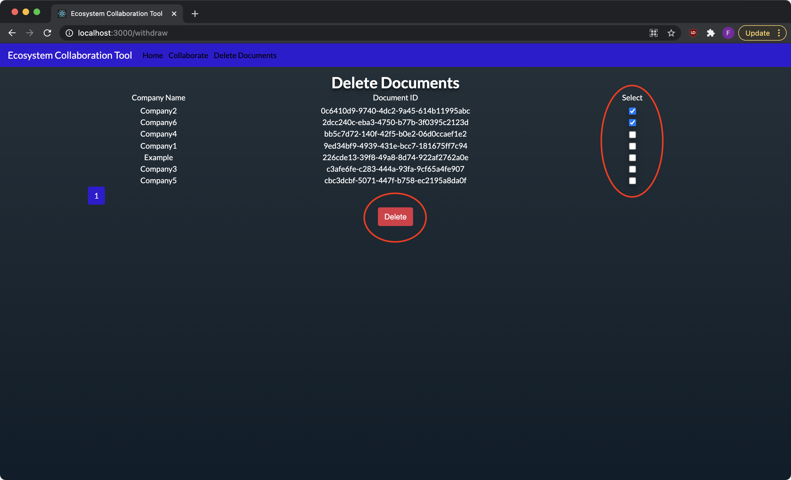

You will then be prompted to confirm that you would like to delete the selected documents. Click the delete button to delete the selected documents.

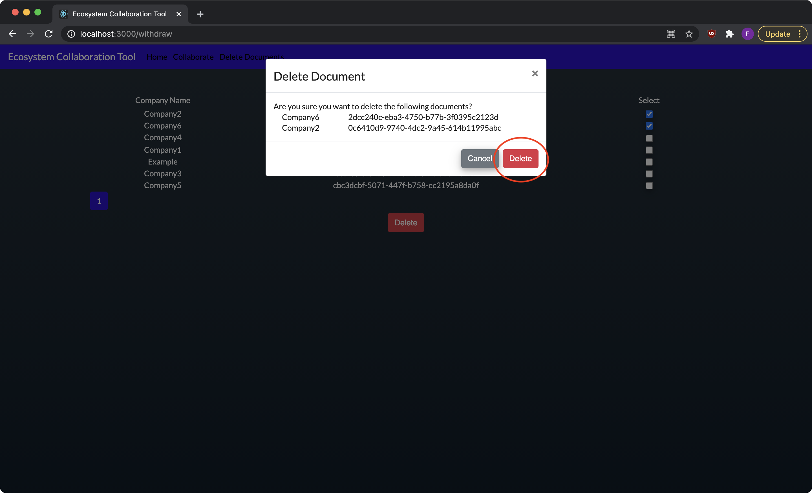
